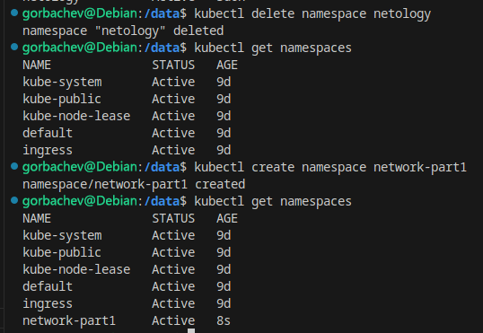
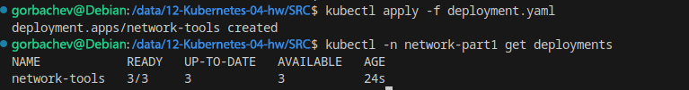
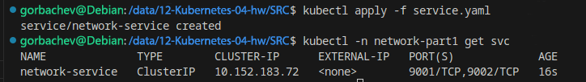
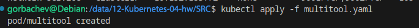
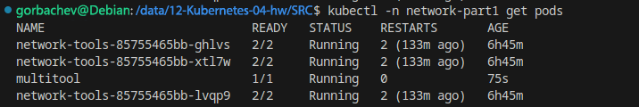
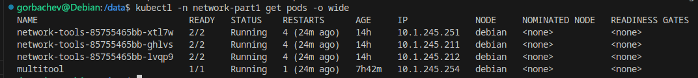
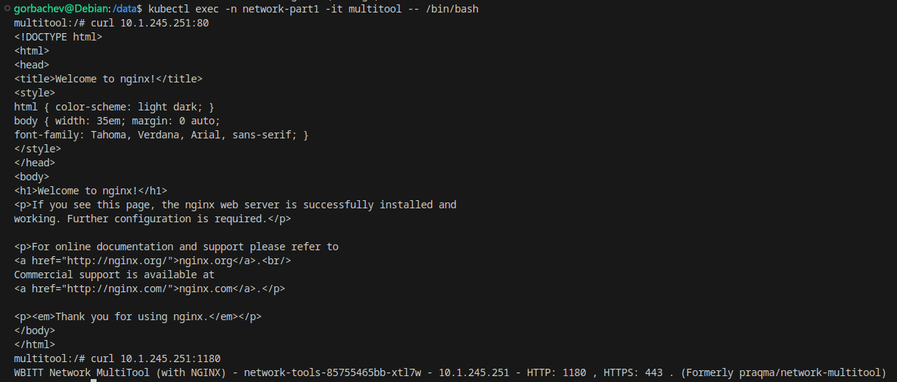
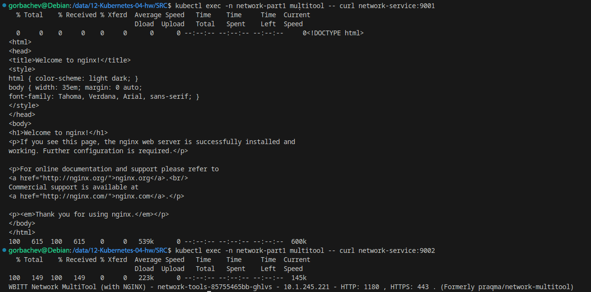
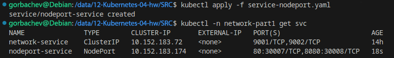
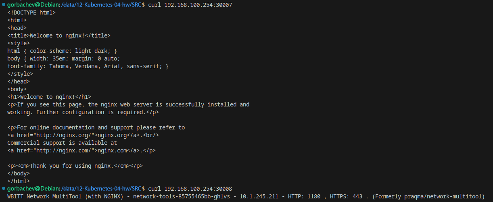

# Домашнее задание к занятию «Сетевое взаимодействие в K8S. Часть 1» `Горбачев Олег`

### Задание 1. Создать Deployment и обеспечить доступ к контейнерам приложения по разным портам из другого Pod внутри кластера

1. Создать Deployment приложения, состоящего из двух контейнеров (nginx и multitool), с количеством реплик 3 шт.
2. Создать Service, который обеспечит доступ внутри кластера до контейнеров приложения из п.1 по порту 9001 — nginx 80, по 9002 — multitool 8080.
3. Создать отдельный Pod с приложением multitool и убедиться с помощью `curl`, что из пода есть доступ до приложения из п.1 по разным портам в разные контейнеры.
4. Продемонстрировать доступ с помощью `curl` по доменному имени сервиса.
5. Предоставить манифесты Deployment и Service в решении, а также скриншоты или вывод команды п.4.

------

### Задание 2. Создать Service и обеспечить доступ к приложениям снаружи кластера

1. Создать отдельный Service приложения из Задания 1 с возможностью доступа снаружи кластера к nginx, используя тип NodePort.
2. Продемонстрировать доступ с помощью браузера или `curl` с локального компьютера.
3. Предоставить манифест и Service в решении, а также скриншоты или вывод команды п.2.

------

### Решение задания 1. Создать Deployment и обеспечить доступ к контейнерам приложения по разным портам из другого Pod внутри кластера

1. Для начала удалю созданный в прошлом задании namespace, чтобы поды из разных работ не мешали друг другу и создам новый namespace:

Пишу манифест Deployment приложения, состоящего из двух контейнеров (nginx и multitool), с количеством реплик 3 шт.

Применяю манифест и проверяю результат:

Deployment создан, количество реплик равно трём.

2. Пишу манифест Service, который обеспечит доступ внутри кластера до контейнеров приложения из п.1 по порту 9001 — nginx 80, по 9002 — multitool 8080.

Применяю манифест и проверяю результат:

Сервис создан и слушает порты 9001 и 9002.

3. Пишу манифест отдельного Pod, с приложением multitool и запускаю его:

Проверяю адреса запущенных подов:

Из пода `multitool` проверяю доступность приложений в подах по одному из IP адресов:

Приложения в подах доступны.

4. С помощью `curl` проверю доступность подов по доменному имени сервиса:

Nginx отвечает через сервис по порту 9001, multitool отвечает по порту 9002.

5. Ссылка на манифест Deployment - https://github.com/RikLedger/12-Kubernetes-04-hw/blob/main/SRC%20/deployment.yaml

   Ссылка на манифест Service - https://github.com/RikLedger/12-Kubernetes-04-hw/blob/main/SRC%20/service.yaml

   Ссылка на манифест Pod - https://github.com/RikLedger/12-Kubernetes-04-hw/blob/main/SRC%20/multitool.yaml

### Решение задания 2. Создать Service и обеспечить доступ к приложениям снаружи кластера

1. Создаю отдельный Service приложения из Задания 1 с возможностью доступа снаружи кластера к nginx, используя тип NodePort:

Сервис с именем nodeport-service и внешними портами 30007 и 30008 создан.

2. С помощью `curl` проверю, доступны ли приложения из подов по внешним портам:

Приложения доступны по локальному IP ноды, на порту 30007 отвечает nginx, на порту 30008 отвечает multitool.

3. Ссылка на манифест Service - https://github.com/RikLedger/12-Kubernetes-04-hw/blob/main/SRC%20/service-nodeport.yaml
